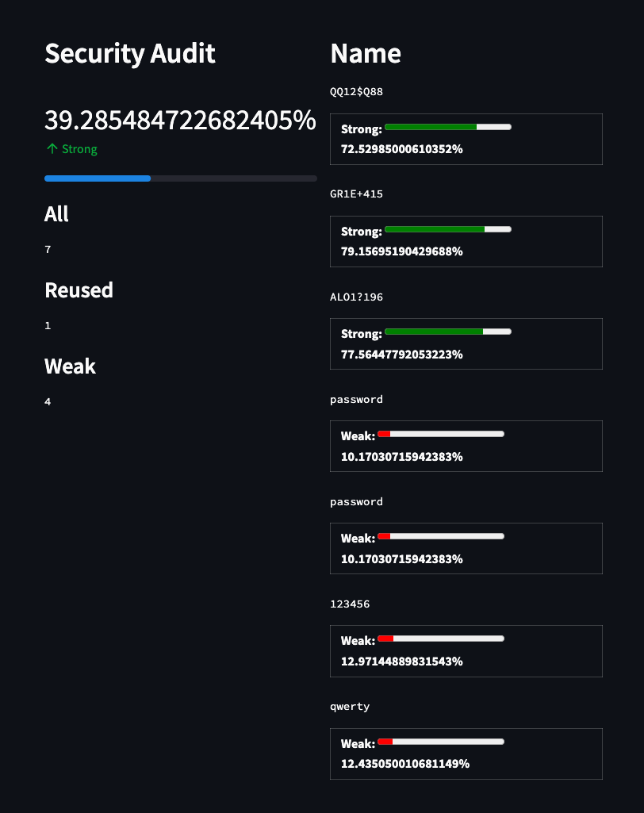
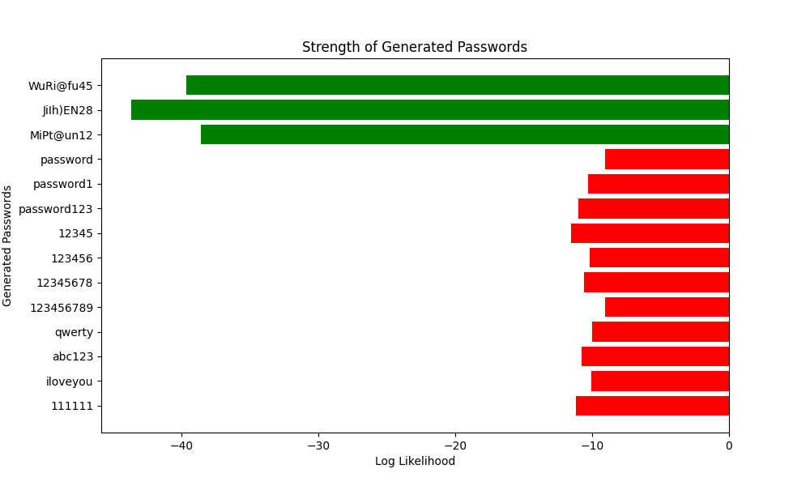
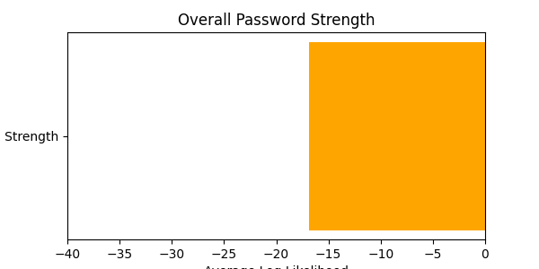
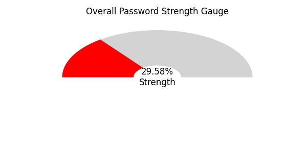

# Offline Password Guessing and Password Strength Estimation Model

## Introduction

How effectively can LLMs capture the underlying characteristics and cues hidden in the complex nature of human generated passwords?

This section explores the capability of Large Language Models (LLMs) to discern intricate patterns and signals embedded in human-generated passwords, which are often complex and nuanced

## Demo

Here is a smaple of the strength estimation model in action inside a streamlit app.

to run this demo, clone this repo, train the model, and run the following command in the terminal to start the service:

```bash
streamlit run streamlit_app.py
```



## Installation and Model Training

This section provides a step-by-step guide to install the required dependencies and train the model. The model was design to be trained on a GPU, specifically the MPS Mac Silicon, but it can be trained on a CPU as well.

1. Open `train.ipynb` in Google Colab or Jupyter Notebook and step through each cell to install the required dependencies and train the model.

>Use of a GPU is highly recommended for training the model. If you are using Google Colab ensure to read to terms of service to ensure you are not violating any of the terms. Adjustments may be needed to support CUDA environments

2. Update the variables to point to the correct data sources, output locations and model parameters.

3. Evaluate the model using `eval.ipynb` to ensure the model is performing as expected.

## The Role of AI in Password Analysis

Artificial Intelligence (AI) offers a unique perspective in identifying passwords that, despite being deemed "strong" by conventional estimators, are vulnerable to being guessed by generative methods. A sophisticated adversary could leverage AI-driven heuristics to target passwords that are both secure and predictable, bypassing the need for exhaustive brute-force methods.

### Data Sources and Methodology

Utilizing a training-testing split of 80%-20%, intentionally skewed to evaluate the model's ability in generating low probability passwords against a substantial sample size from the training set.

To assess the model's generalization capabilities, we employ cross-evaluation with distinct test sets. The training data is used for model development, while the evaluation data, completely separate from the training set, is for performance assessment. For thorough cross-evaluation, for example you can exclude the RockYou data from the HashesOrg2019 dataset and vice versa.

Most are taken from [bruteforce-database](https://github.com/duyet/bruteforce-database)

#### RockYou

The RockYou dataset is a list of 14,344,391 passwords that were leaked in a 2009 data breach. The passwords were stored in plaintext and were not salted or hashed. The dataset is available for download from [here](https://wiki.skullsecurity.org/Passwords).

#### HashesOrg2019

The HashesOrg2019 dataset is a list of 1,279,729,139 passwords that were leaked in a 2019 data breach. The passwords were stored in plaintext and were not salted or hashed. The dataset is available for download from [here](https://hashes.org/public.php).

#### Other Common Password Dictionaries

- 8-more-passwords.txt sorting only passwords with more than 8 characters, removed all numeric passes, removed consecutive characters (3 characters or more), removed all lowercase passwords, passwords without a capital letter and also a number (61.682 password).
- 7-more-passwords.txt it consists of passwords 7 characters or more, and numeric passwords removed (528.136 passwords).
- 1000000_password_seclists.txt 1.000.000 password from SecLists
- bitcoin-brainwallet.lst bitcoin-brainwallet with 394.748 lines
- usernames.txt collection username of/at US - 403.355 lines
- us-cities.txt list 20.580 cities at US
- facebook-firstnames.txt 4.347.667 of Facebook firstnames.
- 2151220-passwords.txt 2.151.220 passwords from dazzlepod.com
- subdomains-10000.txt 10.000 subdomain for domain scanner.
- 38650-password-sktorrent.txt 38.650 passwords from sktorrent.eu.
- uniqpass_v16_password.txt UNIQPASS is a large password list for use with John the Ripper (JtR) wordlist mode to translate large number of hashes, e.g. MD5 hashes, into cleartext passwords
- indo-cities.txt list 102 cities at Indonesia
- 38650-username-sktorrent.txt 38.650 usernames from sktorrent.eu.
- forced-browsing every wordlist you need for forced browsing
- cain.txt 306706 passwords from Cain and Abel

## Evaluation Metrics

The model is evaluated using the following metrics:

### Generation specific results



### Combined Results



